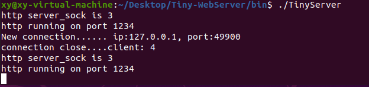
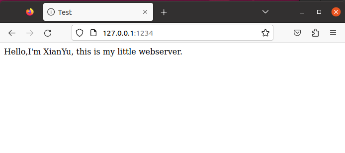
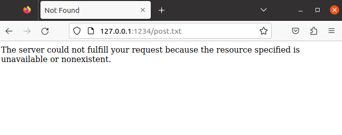

# Tiny-WebServer

# 开发环境

1. 编码语言：C++ 17
2. 操作系统：Ubuntu 20.04 64-bit
3. 编译器：Desktop Qt 6.2.4 GCC 64-bit
4. 数据库：无
5. 图形化：无
6. 代码托管：Github

# 简介

该项目是基于C++17实现的HTTP服务器，也就是那种烂大街的WebServer服务器，不过由于是自己动手做的，所以还是很有意义的就上传上来了。

# 实现的功能

1. 单线程处理
2. 多线程处理

# 编译、执行

```
git clone git@github.com:dancing-ui/Tiny-WebServer.git
cd Tiny-WebServer
cmake .
make
cd bin
./TinyServer
```

# 项目演示

## 1.服务器启动



## 2.初始页面



## 3.表单页面


## 4.页面未发现


